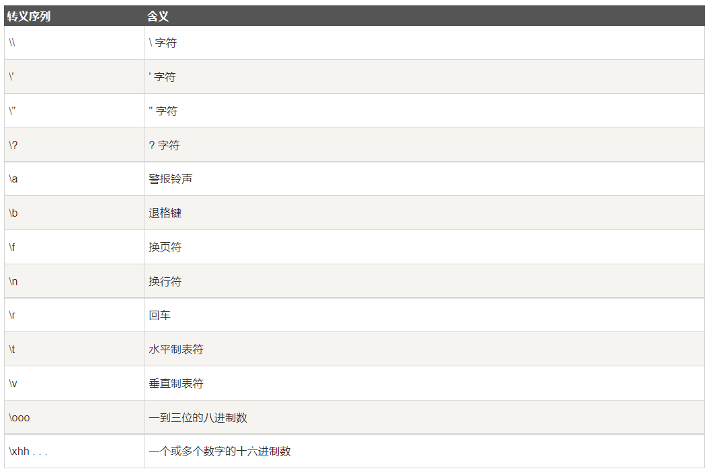
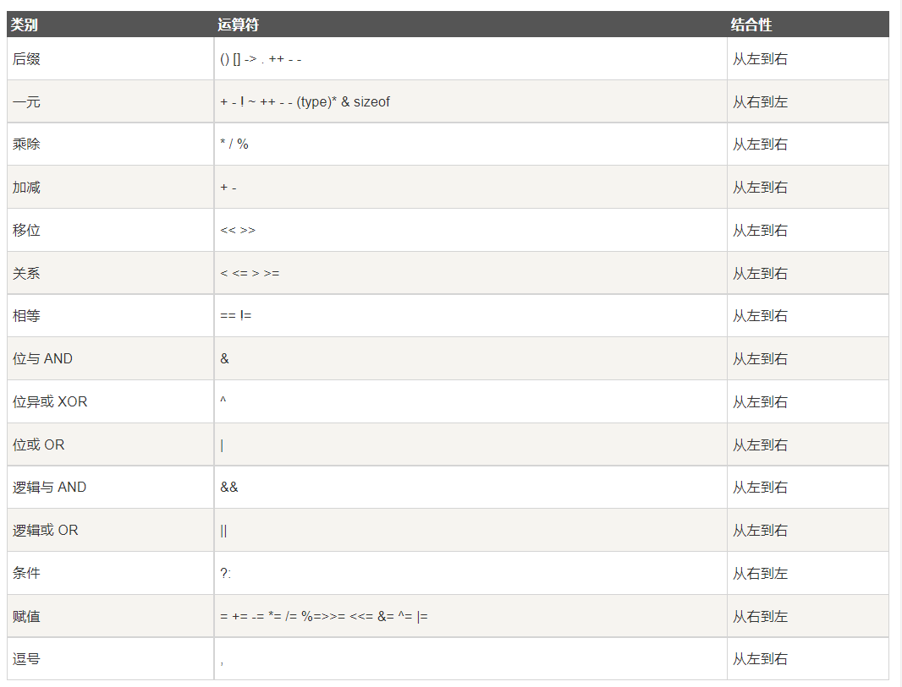
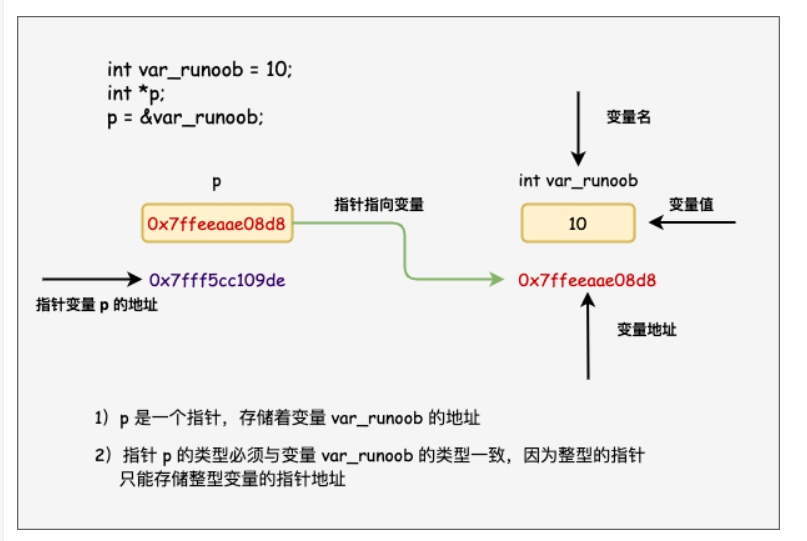
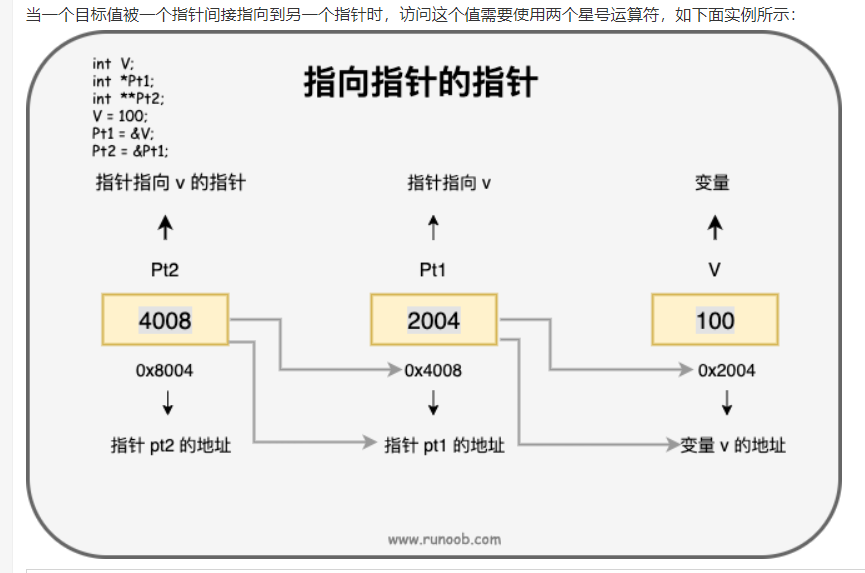
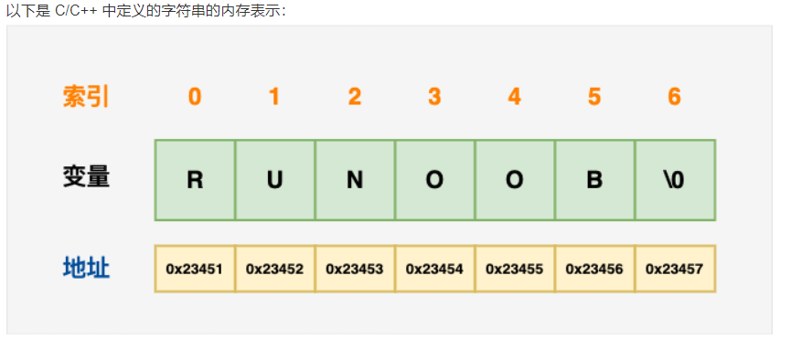
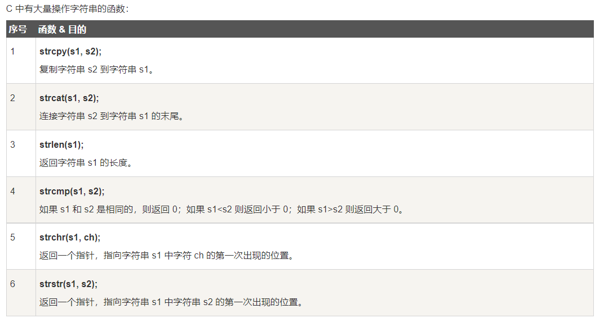
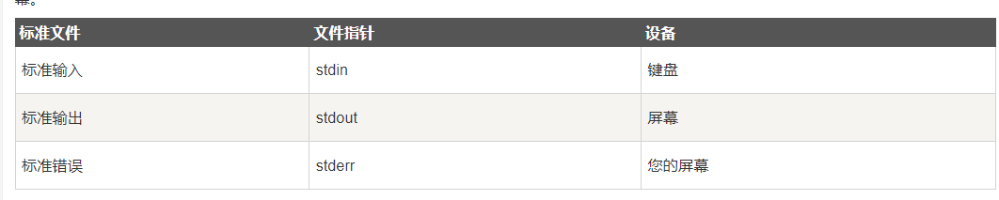
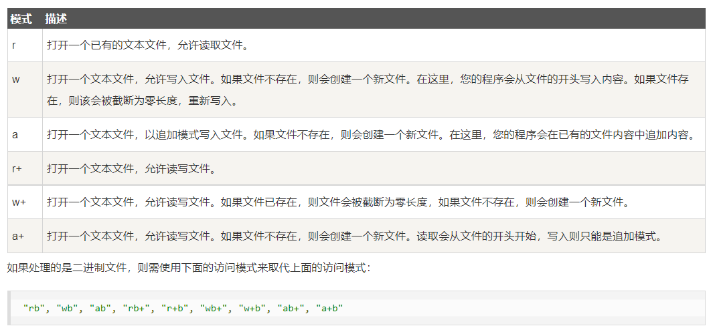
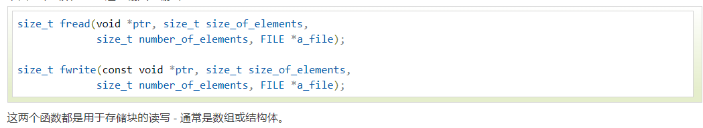
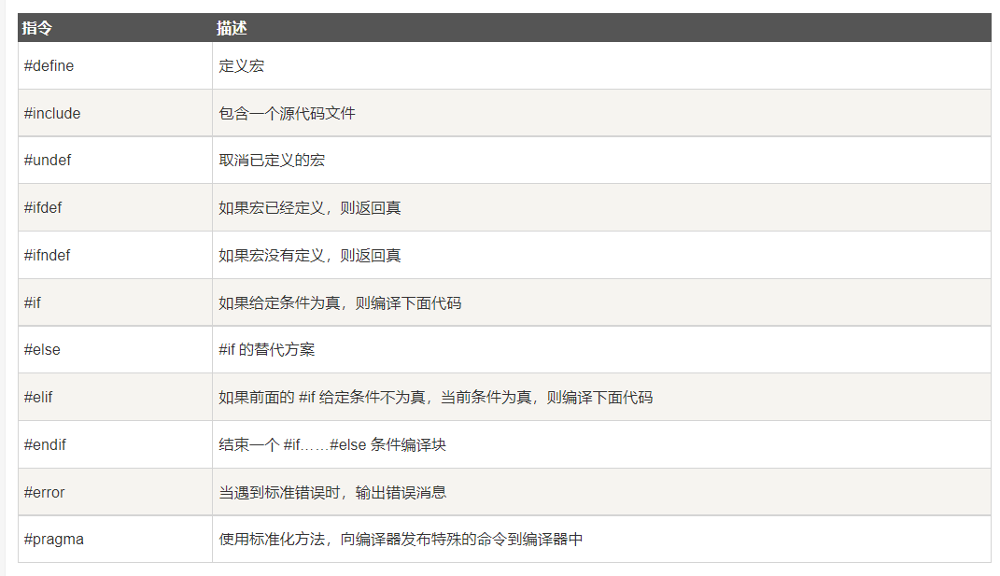

# 1.  简介 
 &emsp; 当前最新C语言标准:`C11` 
 ***
# 2. 基本语法 
# &emsp; 2.1. C的令牌（Token）
&emsp; &emsp;包含关键字、标识符、常量、字符串或者是一个符号。
# &emsp; 2.2. 分号 
&emsp; &emsp;表明一个逻辑实体的结束。
# &emsp; 2.3.注释: 
&emsp; &emsp;单行注释`\\`,多行注释`/* ... */`
 ***
# *3. 关键字
|序号|关键字|说明|
|:-:|:-:|:-:|
|1|auto     |声明自动变量|
|2|break    |跳出当前语句（主要用于循环以及switch语句）|
|3|case     |开关语句分支（主要用于switch语句）|
|4|char     |声明字符型变量或函数返回值类型|
|5|const    |定义常量，如果一个变量被 const 修饰，那么它的值就不能再被改变|
|6|continue |结束当前循环，开始下一轮循环(循环结束（不退出），继续下一个循环)|
|7|default  |开关语句中的"其它"分支|
|8|do       |do..while(1)循环语句的循环体|
|9|double   |声明双精度浮点型变量或函数返回值类型|
|10|else    |条件语句否定分支（与 if 连用）|
|11|enum    |声明枚举类型|
|12|extern  |修改变量或函数的链接属性（外部）|
|11|float   |声明浮点型变量或函数返回值类型|
|12|for     |一种循环语句|
|13|`goto ` |`无条件跳转语句`|
|14|if      |条件语句|
|15|int     |声明整型变量或函数|
|16|long    |声明长整型变量或函数返回值类型|
|17|register|声明寄存器变量|
|18|return  |子程序返回语句（可以带参数，也可不带参数）|
|19|short   |声明短整型变量或函数|
|20|signed  |声明有符号类型变量或函数|
|21|sizeof  |计算数据类型或变量长度（即所占字节数）|
|22|static  |声明静态变量|
|23|struct  |声明结构体类型|
|24|switch  |用于开关语句|
|25|typedef |用以给数据类型取别名|
|26|unsigned|声明无符号类型变量或函数|
|27|union   |声明共用体类型|
|28|void    |声明函数无返回值或无参数，声明无类型指针|
|29|`volatile`|`说明变量在程序执行中可被隐含地改变`|
|30|while   |循环语句的循环条件|
 ***
# *4. 数据类型
# &emsp; 4.1. 基本类型
&emsp; &emsp;它们是算术类型，包括两种类型：整数类型和浮点类型。
# &emsp; 4.2. 枚举类型
&emsp; &emsp;它们也是算术类型，被用来定义在程序中只能赋予其一定的离散整数值的变量。
# &emsp; 4.2. void 类型
&emsp; &emsp;类型说明符 void 表明没有可用的值。
# &emsp; 4.2. 派生类型
&emsp; &emsp;它们包括：指针类型、数组类型、结构类型、共用体类型和函数类型。
>注释1.数组类型和结构类型统称为`聚合类型`。函数的类型指的是函数`返回值的类型`。
 ***
# *5. 变量
# &emsp; 5.1. 简介
&emsp;&emsp;变量其实只不过是程序可操作的存储区的名称。C 中每个变量都有特定的类型，类型决定了变量存储的大小和布局，该范围内的值都可以存储在内存中，运算符可应用于变量上。
&emsp;&emsp;变量的名称可以由字母、数字和下划线字符组成。它必须以字母或下划线开头。大写字母和小写字母是不同的，因为 C 是大小写敏感的。
# &emsp; 5.2. C中的变量定义
&emsp;&emsp;`type variable_list` type 必须是一个有效的 C 数据类型，可以是 char、w_char、int、float、double 或任何用户自定义的对象，variable_list 可以由一个或多个标识符名称组成，多个标识符之间用逗号分隔。 
# &emsp; 5.3. C中的左值和右值
&emsp;&emsp;5.3.1.左值:指向内存位置的表达式被称为`左值`。
&emsp;&emsp;5.3.2.右值:指储存再内存中某些地址的数值`右值`。
>注释2:变量是左值，因此可以出现在赋值号的左边。数值型的字面值是右值，因此不能被赋值，不能出现在赋值号的左边。有效语句： `int g = 20` 无效语句：`10 = 20`
 ***
# 6. 常量
# &emsp; 6.1. 简介
&emsp;&emsp;常量是固定值，在程序执行期间不会改变。这些固定的值，又叫做字面量。
# &emsp; 6.2. 整数常量
&emsp;&emsp;前缀: 0x/0X 十六进制 0 八进制 无前缀 十进制
&emsp;&emsp;后缀: U 无符号整型 L 长整型 
# &emsp; 6.3. 浮点常量
&emsp;&emsp;小数形式 指数形式
# &emsp; 6.4. 字符常量
&emsp;&emsp;6.4.1.通用字符可以简单储存在`char`类型。
&emsp;&emsp;6.4.2.转义字符。

# &emsp; *6.5. 定义常量
&emsp;&emsp;6.5.1.使用#define预处理器
&emsp;&emsp;6.5.2.使用const关键字
```c 
     const   int      temp  =  5;
     关键字 数据类型 变量名称 变量值
```
 ***
# *7.存储类
# &emsp;7.1.auto存储类
&emsp;&emsp;所有局部变量的存储类型。
# &emsp;7.2.register存储类
&emsp;&emsp;7.2.1.用于定义存储在寄存器里的变量。
&emsp;&emsp;7.2.2.不能使用一元运算符`&`。
# &emsp;7.3.*static存储类
&emsp;&emsp;7.3.1.`用于修饰局部变量`，可以使得此变量在程序的生命周期内保持存在，不需要在它每次进入和离开函数作用域时对其进行销毁。
&emsp;&emsp;7.3.2.`用于修饰全局变量`，被修饰的变量作用域被限制在声明它的文件内。
>注释3:全局声明的一个 static 变量或方法可以被任何函数或方法调用，只要这些方法出现在跟 static 变量或方法同一个文件中。
```c 
例:
    #include <stdio.h>
    /* 函数声明 */
    void func1(void);
    static int count=10;        /* 全局变量 - static 是默认的 */
    int main()
    {
        while (count--) 
        {
            func1();
        }
        return 0;
    }
    
    void func1(void)
    {
        /* 'thingy' 是 'func1' 的局部变量 - 只初始化一次
        * 每次调用函数 'func1' 'thingy' 值不会被重置。
        */                
        static int thingy=5;
        thingy++;
        printf(" thingy 为 %d ， count 为 %d\n", thingy, count);
    }
```
***
# emsp;7.4. extern存储类
&emsp;&emsp;7.4.1.提供一个全局变量的引用，全局变量对所有的程序文件都是可见的。
&emsp;&emsp;7.4.2.当您使用 extern 时，对于无法初始化的变量，会把变量名指向一个之前定义过的存储位置。
***
# *8.运算符
# &emsp;8.1.分类:
&emsp;&emsp;算术运算符、关系运算符、逻辑运算符、位运算符、赋值运算符、杂项运算符。
# &emsp;8.2.算术运算符
&emsp;&emsp; `+` `-` `*` `\`(取整) `%`(去模) `++`(自增) `--`(自减)
>注释4: `B = A++` 为A先执行所在表达式,再执行自增操作（B的值为A,A 为A的值加1）。 `B = ++A` 为先执行自增操作，再执行表达式（B的值为A的值加1,A 为A的值加1）。
# &emsp;8.3.关系运算符
&emsp;&emsp; `==` `!=` `>` `<` `>=` `<=`
# &emsp;8.4.逻辑运算符
&emsp;&emsp; `&&` `||` `!` 
# &emsp;8.5.位运算符
&emsp;&emsp; `&` `|` `^`(异或)
# &emsp;8.6.赋值运算符
&emsp;&emsp; `=` `+=` `-=` `*=` `/=` `%=` `<<=` `>>=` `&=` `^=` `|=`
# &emsp;8.7.杂项运算符
&emsp;&emsp;`sizeof()` `&(取地址)` `*(指向变量)` `?:(条件表达式)`
>注释5:如果条件为真？则值为X:否则为Y。
# &emsp;8.8.运算符优先级

***
# 9.判断
&emsp;&emsp;9.1. if语句/if...else...
&emsp;&emsp;9.2. switch语句
&emsp;&emsp; ? : 运算符（三元运算符） 
&emsp;&emsp; `条件？ 真:假`
***
# 10.循环
&emsp;10.1循环类型
&emsp;&emsp;10.1.1 while for do...while 循环嵌套
&emsp;10.2循环控制语句
&emsp;&emsp;`break`(退出循环、退出switch...case)、continue 终止本次循环开始下一次循环 goto 跳转标签
***
# 11.C函数
&emsp;11.1.定义函数
```c
    return_type function_name(parameter list)
    {
        body of the function
    }
```
&emsp;返回类型:函数返回值类型
&emsp;函数名称:函数的实际名称，用于声明以及调用函数。
&emsp;参数:当函数被调用时，向函数传递的值。
&emsp;函数主体:函数内的执行函数。
*** 
# 12.作用域规则
&emsp;12.1.定义:
&emsp;&emsp;作用域是指程序中定义的变量所存在的区域，超过该区域就不能被访问。
>注释6:C中有三个可以地方可以声明变量:1.在函数块内部的`局部变量`。2.所有函数外的`全局变量`。3.在定义函数时定义的`形式参数`。
***
# 13.数组
# &emsp;13.1.概述
&emsp;&emsp;C 语言支持数组数据结构，它可以`存储一个固定大小的相同类型元素的顺序集合。`数组是用来存储一系列数据，但它往往被认为是一系列相同类型的变量。
数组的声明并不是声明一个个单独的变量，比如 runoob0、runoob1、...、runoob99，而是声明一个数组变量，比如 runoob，然后使用 runoob[0]、runoob[1]、...、runoob[99] 来代表一个个单独的变量。
所有的数组都是由连续的内存位置组成。`最低的地址对应第一个元素，最高的地址对应最后一个元素`。
# &emsp;13.2.声明数组
&emsp;&emsp;`type arrayName[arraySize]`.
# &emsp;13.3.初始化数组
&emsp;&emsp;`int array[3] = {0,1,2}`
# &emsp;13.4.访问数组元素
&emsp;&emsp;数组元素可以通过`数组名称加索引进行访问`。`元素的索引`是放在方括号内，跟在数组名称的后边.
# &emsp;13.5.多维数组
&emsp;&emsp;13.5.1.定义: type name[size][size]...[size]
# &emsp;13.6.二维数组
&emsp;&emsp;13.6.1.定义: type arrayName [ x ][ y ];
&emsp;&emsp;13.6.2.初始化:
```c
int a[3][4] = {  
{0, 1, 2, 3} ,   /*  初始化索引号为 0 的行 */
{4, 5, 6, 7} ,   /*  初始化索引号为 1 的行 */
{8, 9, 10, 11}   /*  初始化索引号为 2 的行 */
              };
```
&emsp;&emsp;13.6.2.访问:二维数组中的元素是通过使用下标（即数组的行索引和列索引）来访问的。
# &emsp;13.7.向函数传递数组
&emsp;&emsp;13.7.1.方式1:
```c
void Function(int *param)
{}
```
&emsp;&emsp;13.7.2.方式2:形式参数为一个`定长`的数组
```c
void Function(int param[10])
{}
```
&emsp;&emsp;13.7.3.方式3:形式参数为一个`未定义长度`的数组
```c
void Function(int param[])
{}
```
# &emsp;13.8.从函数返回数组
&emsp;&emsp;C 语言不允许返回一个完整的数组作为函数的参数。但是，您可以通过指定不带索引的数组名来返回一个指向数组的指针。
>注释7:C 不支持在函数外返回局部变量的地址，除非定义局部变量为 static 变量。
# 14.枚举
# &emsp;14.1.枚举的定义
&emsp;&emsp;1.先定义枚举类型后定义变量
```c
// 定义枚举类型
enum DAY
{
    MON = 1, TUE, WED, THU, FRI, SAT, SUN   
}
// 定义枚举变量
enum DAY day
```
&emsp;&emsp;2.定义枚举类型同时定义变量
```c
// 定义枚举类型同时定义枚举变量
enum DAY
{
    MON = 1, TUE, WED, THU, FRI, SAT, SUN   
}day
```
&emsp;&emsp;3.直接定义枚举变量
```c
// 直接定义枚举变量
enum 
{
    MON = 1, TUE, WED, THU, FRI, SAT, SUN   
}day
```
>注释8:枚举元素可不连续
# **15.指针**
# &emsp;15.1概念
&emsp;&emsp;15.1.1. 指针: 内存地址。
&emsp;&emsp;15.1.2. 指针变量: 用来存放内存地址的变量。

# &emsp;15.2指针变量声明
&emsp;&emsp;type *var-name  `type`:表明指针指向变量的类型 `*var-name`:指针变量的名称
# &emsp;15.3指针的使用
&emsp;&emsp;15.3.1.指针常用操作:定义一个指针变量、把`变量的地址`赋值给指针、`访问指针变量中可用地址的值`.
&emsp;&emsp;15.3.2. `&`:取地址符 `*`指向地址的值。
# &emsp;15.4.NULL指针
&emsp;&emsp;NULL指针为指向`空`（地址为0x0）的指针，若定义指针时无确切地址，将地址赋值为`NULL`是一个好习惯。
>注释9.可以判断指针是否为`NULL`指针.
```c
if(ptr)   /*若指针为空，则...*/
if(!ptr)  /*若指针不为空，则...*/
```
# &emsp;15.5.C指针的算术运算
&emsp;&emsp;15.5.1. `++` `--` `+` `-` 
&emsp;&emsp;1.指针的每一次递增，就是指向下一个元素的存储单元。
&emsp;&emsp;2.指针的每一次递减，就是指向前一个元素的存储单元。
&emsp;&emsp;3.指针在递增和递减时跳跃的字节取决于指针所指向变量的数据类型长度,为sizeof(数据类型)
# &emsp;15.6.指针的比较
&emsp;&emsp;关系运算符 `==` `<` `>` 
# &emsp;15.7.指针数组
&emsp;&emsp;`int *ptr[MAX]` 存放MAX个`整型指针变量`的数组
# &emsp;15.8.指向指针的指针
&emsp;&emsp;`int **var`:二位指针 指向指针的指针

# &emsp;15.9.给函数传递指针
&emsp;&emsp;将函数形参声明为`指针类型`即可。
# &emsp;15.10.从函数返回指针
&emsp;&emsp;将函数`返回值`类型声明为指针类型
```c
int *myFunction()
{
    .
    .
    .
}
```

# &emsp;15.11.函数指针
&emsp;&emsp;15.11.1.概念:指向函数的指针，可以向一般函数一样，用于调用函数、传递参数。
# &emsp;15.12.回调函数
&emsp;&emsp;15.12.1.概念: `函数指针`作为某个函数(回调函数)的参数。
```c
example:
#include <stdlib.h>  
#include <stdio.h>

// 回调函数
void populate_array(int *array, size_t arraySize, int (*getNextValue)(void))
{
    for (size_t i=0; i<arraySize; i++)
        array[i] = getNextValue();
}
 
// 获取随机值
int getNextRandomValue(void)
{
    return rand();
}
 
int main(void)
{
    int myarray[10];
    /* getNextRandomValue 不能加括号，否则无法编译，因为加上括号之后相当于传入此参数时传入了 int , 而不是函数指针*/
    populate_array(myarray, 10, getNextRandomValue);
    for(int i = 0; i < 10; i++) {
        printf("%d ", myarray[i]);
    }
    printf("\n");
    return 0;
}
```
# 16.C字符串
&emsp;16.1.概念
&emsp;&emsp;在 C 语言中，字符串实际上是使用 null 字符 \0 终止的一维字符数组。因此，一个以 null 结尾的字符串，包含了组成字符串的字符。

&emsp;16.2.字符串函数

# 17.结构体
# &emsp;17.1.数组与结构体的不同：
&emsp;&emsp;数组是用来存储多个相同类型数据项的变量，`结构`是一种由用户自定义的可用的数据类型，它允许存储不同类型的数据项。
# &emsp;17.2.定义结构
```c
struct tag{
    member-list;
    member-list;
    book_pointer;
    ...
}variable-liat;
```
&emsp;&emsp;`tag`是结构标签，`member-list`是结构体成员 `variable-liat` 结构类型
>注释8:一般情况下`tag`、`member-list`、`variable-liat`这三者中需出现2个。
# &emsp;17.3.结构体成员也为结构体
&emsp;&emsp;结构体的成员可以包含其他结构体，也可以包含指向自己结构体类型的指针，而通常这种指针的应用是为了实现一些更高级的数据结构如链表和树等。
# &emsp;17.4.访问结构体成员
&emsp;&emsp;访问结构体成员运算符`.`。
# &emsp;17.5.将结构体传入函数
&emsp;&emsp;与其他变量或指针类似。
# &emsp;17.6.指向结构的指针
&emsp;&emsp;17.6.1.结构体指针定义 `struct tag *book_pointer`.
&emsp;&emsp;17.6.2.取地址运算符`&` `book_pointer = &variable-liat`
&emsp;&emsp;17.6.3.访问结构体指针成员`->` `book_pointer -> book_pointer`
# 18.共用体
# &emsp;18.1.概念
&emsp;&emsp;共用体是一种特殊的数据类型，允许您在相同的内存位置存储不同的数据类型。您可以定义一个带有多成员的共用体，但是任何时候只能有`一个成员`带有值。共用体提供了一种使用`相同的内存位置`的有效方式。
# &emsp;18.2.定义共用体
```c
union [union tag]
{
    member definition;
    member definition;
    ...
    member definition;
}[one or more union variables]
```
&emsp;&emsp;`union tag`共用体数据类型 `member definition` 共用体成员 `one or more union variables` 共用体变量
# &emsp;18.3.访问共用体成员
&emsp;&emsp;成员访问运算符`.`
# 19. 位域
# 19.1 概念
&emsp;&emsp;有些信息在存储时，并不需要占用一个完整的字节，而只需占几个或一个二进制位。例如在存放一个开关量时，只有 0 和 1 两种状态，用 1 位二进位即可。为了节省存储空间，并使处理简便，C 语言又提供了一种数据结构，称为`位域`或`位段`。
```c
// 示例1 占用8个字节
struct
{
  unsigned int widthValidated;
  unsigned int heightValidated;
} status;

// 示例2 占用4个字节 且只有两位被用来存储值
struct
{
  unsigned int widthValidated  : 1;
  unsigned int heightValidated : 1;
} status;
```
# 19.2 位域声明
```c
// 位域形式
struct 位域结构名
{
   ` type [member_name] : width ;`(位域列表)
   type: 只用三种类型: `int` `signed int` `unsigned int`
   member_name: `位域的名称`
   width : `所占字节的数量`
};
```
# 19.3 位域使用说明
&emsp;&emsp;19.1.1.一个位域存储在同一字节中若剩下的位域字节不够，则从下一个字节开始，也可以故意使用空域是某一位从下一个字节开始。
```c
struct 
{
    int a:4
    int  :4 /*空域*/
    int c:4
}
```
&emsp;&emsp;19.1.2.位域不能超过它所依附数据类型的长度。
&emsp;&emsp;19.1.3.位域可以是无名位域但是无名位域无法使用。
```c
struct k{
    int a:1;
    int  :2;    /* 该 2 位不能使用 */
    int b:3;
    int c:2;
};
```
&emsp;&emsp;19.1.4.位域使用与结构体一致，使用符号`.` `->`.
# 20. typedef
# 20.1.定义
&emsp;&emsp;typedef 用于将C中任意数据类型重新去一个新的名字。
# 20.2.typedef与#define
&emsp;&emsp;20.2.1. typedef仅仅定义数据类型 #define 不仅可以定义数据类型也可以为数值定义别称。
&emsp;&emsp;20.2.2. typedef由编译器执行解释 #define 由预编译进行处理。
# 21. 输入&输出
# emsp;21.1. 标准文件
&emsp;&emsp;
# emsp;21.2. printf()函数
&emsp;&emsp;21.2.1. 用于输出到屏幕。
&emsp;&emsp;21.2.2. 声明在头文件 ` include<stdio.h> `
# emsp;21.3. getchar()函数
&emsp;&emsp;21.3.1. 从屏幕获取`一个`可用字符。
&emsp;&emsp;21.3.2. 返回值为一个整数。
# emsp;21.4. putchar()函数
&emsp;&emsp;21.4.1. 把字符输出到屏幕上。
&emsp;&emsp;21.4.2. 输入形参为整数。
&emsp;&emsp;21.4.3. 返回值为整数。
# emsp;21.5. gets()函数
&emsp;&emsp; `char *gets(char *s)` 从`stdin`读取一行到`s`所指向的缓冲区，直到一个`终止符`或`EOF`。 
# emsp;21.6. puts()函数
&emsp;&emsp; `int puts(const char *s)` 把字符串`s`和一个`尾随的换行符`写入到`stdout`
# emsp;21.7. scanf()函数
&emsp;&emsp;`int scanf(const char *format,...)`函数从标准`输入流``stdin`读取输入，并根据`format`浏览输入。
# emsp;21.7. printf()函数
&emsp;&emsp;`int printf(const char *format,...)`把输出写到标准`输出流``stdout`,并根据格式产生输出。
# 22. 文件读写
# 22.1.打开/创建文件 
&emsp;&emsp;`FILE *fopen(const char *filename, const char *mode)`
&emsp;&emsp;`filename`文件名称 `mode`:文件模式
&emsp;&emsp;
# 22.2.关闭文件 
&emsp;&emsp;`int fclose( FILE *fp )`
&emsp;&emsp;此函数用于关闭文件，若执行失败返回`EOF`.实际上该函数会清空缓冲区中的数据并且关闭文件并释放该文件所占用的内存。
# 22.3.写入文件
&emsp;&emsp;`int fputc( int c, FILE *fp )` `int fputs( char* s, FILE *fp )`
&emsp;&emsp;将`c`写入到`fp`所指向的流中。   将字符串`s`写入到`fp`所指向的流中。
# 22.4.读取文件
&emsp;&emsp;`int fgetc(int c, FILE *fp )` `int fgets(char *s, int n, FILE *fp )`
&emsp;&emsp;从`fp`流中读取`c`  从`fp`流中读取`**n-1**`个字符，将读取的字符串复制到`buf`中，并在最后加`NULL`终止字符串。
>注释1:如果这个函数在读取最后一个字符之前就遇到一个换行符 '\n' 或文件的末尾 EOF，则只会返回读取到的字符，包括换行符。您也可以使用 int fscanf(FILE *fp, const char *format, ...) 函数来从文件中读取字符串，但是在遇到第一个空格和换行符时，它会停止读取。
>注释2:
# 23. 预处理器/CPP
# &emsp;23.1.概述
&emsp;&emsp;23.1.1.在编译之前单独进行的操作。
&emsp;&emsp;23.1.2.所有的预处理以`#`开头。
&emsp;&emsp;23.1.3.
# &emsp;23.2.预处理器运算符
&emsp;&emsp;23.2.1.宏延续运算符`\` 一个宏通常写在一个单行上。但是如果宏太长，一个单行容纳不下，则使用宏延续运算符（\）.
&emsp;&emsp;23.2.2.字符串常量化运算符`#` 需要把一个宏的参数转换为字符串常量时，则使用字符串常量化运算符（#）。
&emsp;&emsp;23.2.3.标记粘贴运算符 `##` 宏定义内的标记粘贴运算符（##）会合并两个参数。它允许在宏定义中两个独立的标记被合并为一个标记。
&emsp;&emsp;23.2.4.`#define()运算符` 用来确定标识符是否已经使用#define定义过，若定义过了返回`真`，否则返回`假`。
&emsp;&emsp;23.2.5.参数化的宏/带参宏
```c
example:
#define swap(x,y) x= x^y, y= x^y, x= x^y
```
# 24. 头文件
# &emsp;24.1.类型
&emsp;&emsp;24.1.1.编译器自带的头文件: `#include <head.h>`.
&emsp;&emsp;24.1.2.用户自定义的头文件: `#include “head.h”`
# &emsp;24.2.只引用一次
&emsp;&emsp;条件编译
```c
#ifndef HEADER_FILE
#define HEADER_FILE
#endif
```
# &emsp;24.3.有条件引用
&emsp;&emsp;24.3.1.在不同开发环境下使用不同头文件
```c
**example1 : 条件编译 **
#if SYSTEM_1
   # include "system_1.h"
#elif SYSTEM_2
   # include "system_2.h"
#elif SYSTEM_3
   ...
#endif

**example2 : 宏定义替换头文件 **
#define SYSTEM_H "system_1.h"
 ...
 #include SYSTEM_H
```
