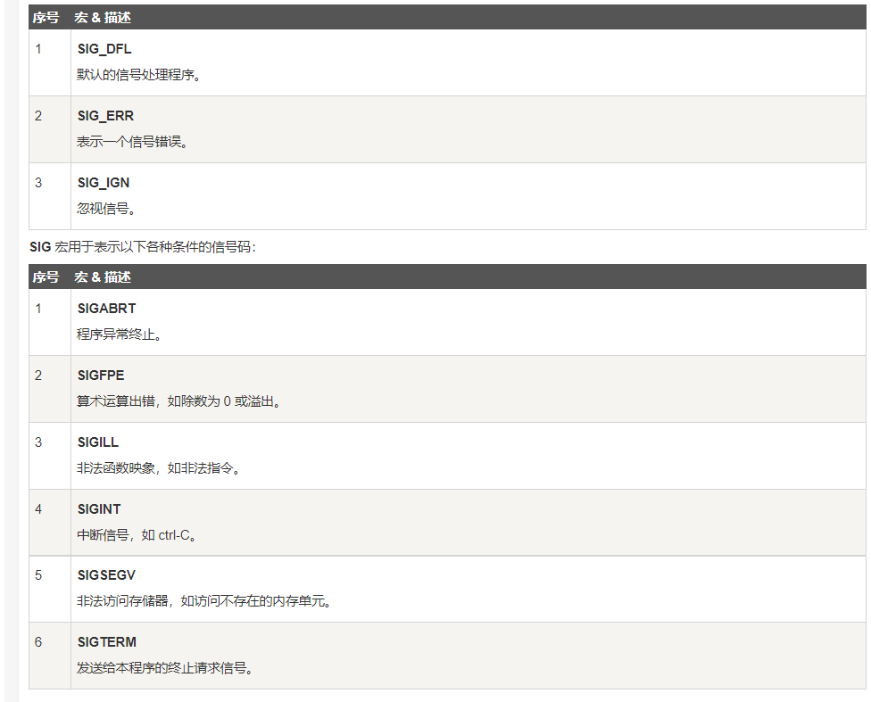

# 1.include<assert.h>(断言)
# emsp;1.1.简介
&emsp;&emsp;1.1.1.C 标准库的 assert.h头文件提供了一个名为 assert 的宏，它可用于验证程序做出的假设，并在假设为假时输出诊断消息。
&emsp;&emsp;1.1.2.在调试结束后，可以通过在包含 #include 的语句之前插入 #define NDEBUG 来禁用 assert 调用，示例代码如下：
```c
    #include 
    #define NDEBUG 
    #include
```
# emsp;1.2.库宏

>注释:assert只在debug版本有效,在release中无效.
***
# 2.include<ctype.h>
# &emsp;2.1.简介
&emsp;&emsp;2.1.1.提供了一些可用于`测试和映射字符`的函数。
&emsp;&emsp;2.1.2.这些函数接受`int`形参数作为形参（必须是`EOF`或`无符号字符`）。
&emsp;&emsp;2.1.3.返回值:正常为`TURE`,异常为`0`
&emsp;&emsp;[ctype.h库函数](https://www.runoob.com/cprogramming/c-standard-library-ctype-h.html)
***
# 3.include<errno.h>
# &emsp;3.1.简介
&emsp; &emsp;C 标准库的 errno.h 头文件定义了整数变量 errno，它是通过系统调用设置的，在错误事件中的某些库函数表明了什么发生了错误。该宏扩展为类型为 int 的可更改的左值，因此它可以被一个程序读取和修改。
&emsp; &emsp;在程序启动时，errno 设置为零，C 标准库中的特定函数修改它的值为一些非零值以表示某些类型的错误。您也可以在适当的时候修改它的值或重置为零。
&emsp; &emsp;errno.h 头文件定义了一系列表示不同错误代码的宏，这些宏应扩展为类型为 int 的整数常量表达式。
&emsp;&emsp;
***
# 4.include<float.h>
# &emsp;4.1.简介
&emsp;&emsp;定义了一些与浮点型相关的常量。

# &emsp;4.2.库宏[float.h库宏](https://www.runoob.com/cprogramming/c-standard-library-float-h.html)
***
# 5.include<limits.h>
# &emsp;5.1.简介
&emsp;&emsp;决定了各种变量类型的各种属性，并且定义在这个头文件的`宏限制了各种类型变量的值`。
# &emsp;5.2.库宏[limits.h库宏](https://www.runoob.com/cprogramming/c-standard-library-limits-h.html)
***
# 6.include<locale.h>
# &emsp;6.1.简介
&emsp;&emsp;`locale.h`头文件定义了特定地域的设置，比如日期格式和货币符号。主要内容:一个重要结构`struct lconv`、两个重要函数。
# &emsp;6.1.库宏、库函数
&emsp;&emsp;
&emsp;&emsp;库函数:[locale库宏.png](https://www.runoob.com/cprogramming/c-standard-library-locale-h.html)
***
# 7.include<math.h>
# &emsp;7.1.简介
&emsp;&emsp;该头文件定义了各种数学函数以及一个宏，在该库中的每一个函数所有可用功能均带有一个double型参数，并返回double型
# &emsp;7.2.库宏
&emsp;&emsp;`HUGE_VAL`
&emsp;&emsp;当函数的结果不可以表示为浮点数时。如果是因为结果的幅度太大以致于无法表示，则函数会设置 errno 为 ERANGE 来表示范围错误，并返回一个由宏 HUGE_VAL 或者它的否定（- HUGE_VAL）命名的一个特定的很大的值。
&emsp;&emsp;如果结果的幅度太小，则会返回零值。在这种情况下，error 可能会被设置为 ERANGE，也有可能不会被设置为 ERANGE。
# &emsp;7.3.库函数[math.h库函数]（https://www.runoob.com/cprogramming/c-standard-library-math-h.html）
***
# 8.include<setjmp.h>
# emsp;8.1.简介
&emsp;&emsp;该头文件定义了宏`setjmp()`、函数`longjmp()`和变量类型`jmp_buf`,该变量会绕过正常的函数调用和返回规则。
# emsp;8.2.库变量
&emsp;&emsp;`jmp_buf`:这是一个用于存储setjmp()和函数longjmp()相关信息的`数组类型`。
# emsp;8.3.库宏
&emsp;&emsp;`int setjmp(jmp_buf environment)`这个宏把当前环境变量保存在`environment`中，以便于longjmp()后续使用。如果这个宏直接从宏定义中返回，则它返回值为0，但是如果它从longjmp()函数调用中返回，则它会返回一个非零值。
# emsp;8.4.库函数
&emsp;&emsp;`void longjmp(jmp_buf environment, int value)`该函数恢复最近一次调用setjmp()宏时保存的环境，`mp_buf`参数的设置由之前调用setjmp()生成的。[setjmp.h使用方法](https://www.runoob.com/cprogramming/c-function-longjmp.html).
***
# 9.include<signal.h>
# &emsp;9.1.简介
&emsp;&emsp;该头文件定义了一个变量类型`sig_atomic_t`、两个函数调用和一些宏来处理程序执行期间报告的不同信号。
# &emsp;9.2.库变量
&emsp;&emsp;`sig_atomic_t`这是`int`类型，在信号处理程序中作为变量使用。它是一个对象的整型数据，该对象可以作为一个原子实体访问，即使存在异步信号时，该对象可以作为一个原子实体访问。
# &emsp;9.3.库宏
&emsp;&emsp;
# &emsp;9..库函数
&emsp;&emsp;
***
# 10.include<stdarg.h>
## &emsp;10.1.简介
&emsp;&emsp;定义了一个变量类型`va_list`和三个宏，这三个宏可用于在参数个数未知(参数可变)函数。
>注释:可变参数在函数通常在列表的末尾是使用省略号(...)定义的。
## &emsp;10.2.库变量
。
## &emsp;10.3.库宏
。
***
# 11.include<stddef.h>
## &emsp;11.1.简介
&emsp;&emsp;定义了各种变量类型和宏。
## &emsp;11.2.库变量
&emsp;&emsp;.
## &emsp;11.2.库宏
&emsp;&emsp;。
***
# 12.include<stdio.h>
## &emsp;12.1.简介
&emsp;&emsp;定义了`三个变量类型`，一些`宏`和`各种函数`来执行输入和输出。
## &emsp;12.2.库变量
&emsp;&emsp;
## &emsp;12.2.库宏/库函数
&emsp;&emsp;[库宏和库函数](https://www.runoob.com/cprogramming/c-standard-library-stdio-h.html)
***
# 13.include<stdlib.h>
## 13.1.简介
&emsp;&emsp;stdlib .h 头文件定义了`四个变量类型`、一些宏和各种通用工具函数。
## 13.2.库变量/库宏/库函数
&emsp;&emsp;[库变量/库宏/库函数](https://www.runoob.com/cprogramming/c-standard-library-stdlib-h.html)
***
# 14.include<string.h>
## 14.1.简介
&emsp;&emsp;string .h 头文件定义了一个变量类型、一个宏和各种操作字符数组的函数。
## 14.2.库变量/库宏/库函数
&emsp;&emsp;[库变量/库宏/库函数](https://www.runoob.com/cprogramming/c-standard-library-string-h.html)
***
# 15.include<time.h>
## 15.1.简介
&emsp;&emsp;time.h 头文件定义了四个变量类型、两个宏和各种操作日期和时间的函数。
## 15.2.库变量/库宏/库函数
&emsp;&emsp;[库变量/库宏/库函数](https://www.runoob.com/cprogramming/c-standard-library-time-h.html)


